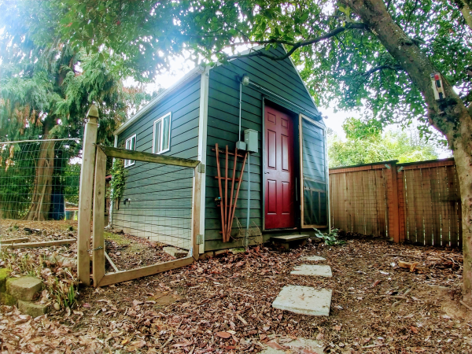

```{r global, include=FALSE}
# TODOs 
# 1) implement future for api call

library(flexdashboard)
library(reticulate)
library(g2r)
library(shiny)
library(lubridate)
library(dplyr)

source("R/g2r.R")
source("R/clean_data.R")

# Required calls an error if not able to load python
# py_install("influxdb", pip = T)
# py_install("python-dotenv", pip = T)
  
use_python(python = "/usr/bin/python3")
source_python("py/influx.py")

# return all data points within allotated time frame
dat <- get_temperature_data(hours_back = 24*30)

# convert to West Coast Time
dat$time <- lubridate::with_tz(dat$time,
                               tzone = "America/Los_Angeles")

# pull out first time stamp
now <- dat[1, ]

dat <- clean_data(dat, "5 mins")
```

## Inputs {.sidebar}

Near real time temperature and humidity data for my office in NE Portland Oregon.

```{r}
# Some JS to make buttons act like radio buttons, 
# could be useful in styling custom radio buttons
# $('.button').click(function() {
#    $('.button').removeClass('active');
#    $(this).addClass('active');
# });
shinyWidgets::radioGroupButtons(
  "time",
  "Time Frame",
  selected = 3,
  size = "normal",
  direction = "vertical",
  status = "primary" ,
  justified = F,
  choiceNames = c("3H",
                  "1D",
                  "1W",
                  "1M"),
  choiceValues = c(3,
                   24,
                   24 * 7,
                   24 * 30)
)
```

I work in a detached building from the main house which only has a space heater. I wanted to track how the temp changes throughout the day while I'm working.

## Row {.tabset .tabset-fade data-height=700}

### Temperature

```{r temp graph}
# Calcualte a stay above time
renderG2({
  # React to radio inputs
  d <- subset(dat, interval >= now[["time"]] - hours(as.numeric(input$time)) )

  g2plot(d, 'temperature')
})
```

### Humidity

```{r humidity graph}
renderG2({
  # React to radio inputs
  d <- subset(dat, interval >= now[["time"]] - hours(as.numeric(input$time)))

  g2plot(d, 'humidity')
})
```

### Details

I built the temp sensor using a Raspberry Pi 3 and [Adafruit DHT-22](https://www.adafruit.com/product/385) which records temperature and humidity to the Pi with a simple python script.

The data is pushed to an InfluxDB on a remote server from the Pi using [Telegraf](https://www.influxdata.com/time-series-platform/telegraf/). This page pulls the data from the database with python and then visualizes through flexdashboard.

There is a separate repo which details the [setup of the pi temp sensor](https://github.com/mxblsdl/dht)

### Office

A shot of my office 


## Row

### Current Conditions

```{r}
fluidRow(column(width = 6,
                div(
                  class = "boxxy",
                  p("Current Temperature"),
                  h2(class = "boxxy-value",
                     countup::countup(
                       now[["temperature"]], options = list(useEasing = T,
                                                             suffix = " Degrees")
                     ))
                ) # end div
                ), # end column
                column(width = 6,
                       div(
                         class = "boxxy",
                         p("Relative Humidity"),
                         h2(class = "boxxy-value",
                            countup::countup(
                              now[["humidity"]], options = list(
                              useEasing = T,
                              suffix = " %"
                            )))
                       ) # end div
                       ) # end column
)
```

